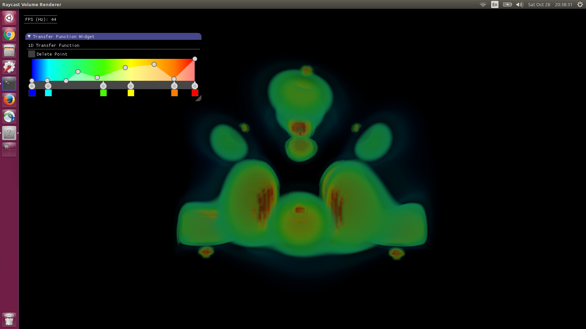

# Raycasting Volume Renderer #

## How to Compile ##

```
mkdir build
cd build
cmake .. -DCMAKE_BUILD_TYPE=Release
make -j8
```

## How to Run ##

```
cd build
./viewer_slice ../data/neghip.json
```

## Rendered Images ##


